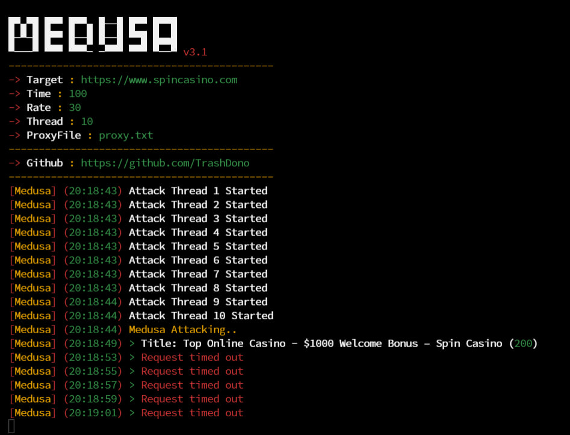

# MegaMedusa Layer-7 DDoS Tool v3.1
 
 
 ### Security that MegaMedusa can bypass :
- UAM Challenges Bypass ✅
- Cloudflare NoSec ✅
- DDoS Guard Bypass ✅
- vShield Website Bypass ✅
- ShieldSquare Captcha Bypass ✅
  
 ### Update v3.1 :
- Lagging Fixed & More Compatible
- More power & bypasses
- Ram & Cpu Usage (Low)
- Fixed Bugs
 ## Usage :
```
Usage: node MegaMedusa.js <link> <time> <rps> <threads> <proxy> --max-old-space-size=<ram limit>
Example: node MegaMedusa.js https://example.com 500 30 10 proxy.txt --max-old-space-size=3000
```
## Instructions :
- **Target**: By entering the victim's link target, you will be able to run a zombie botnet army to attack the victim
- **RPS**: Requests per second: A metric that measures the throughput of a system
- **Threads**: threads is a measure of bytes
- **Proxy**: While using proxy, you will attack in different ip & country and make traffic flooding
- **--max-old-space-size**: This for limit your ram usage to avoid throttle / lag
 ## Installation Command :
```
sudo apt install curl 
curl https://raw.githubusercontent.com/creationix/nvm/master/install.sh | bash
source ~/.bashrc
nvm install --lts
python3 installer.py
```
 ## Proxy Scrape Command :
```
node scraper.js
```
 ## OS Support :
 --> Ubuntu / Linux / Debian / Windows / Termux

## Refference :
<a href="https://t.me/RipperSec"></a>

## If you want to donate, click on the button :
<a href="https://sociabuzz.com/kudagila/donate"></a>

## Disclaimer :
This tool only for Education, Pentesting, and Research Purposes!

